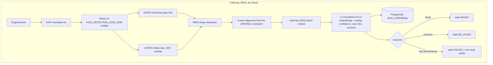
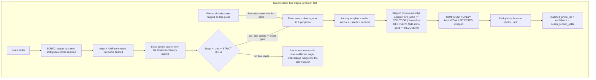

# Face Engine v2

SCRFD-10G detection + AdaFace IR101 (WebFace12M) recognition, exact in-memory search, and a precision-first two-stage identity algorithm. Replaces the GhostFaceNet/DeepFace pipeline.

## How it works





Anti-contamination rules: only strict, quality-gated matches seed the template; Stage B results never become seeds; expansion runs exactly once; the selfie stays a permanent anchor; a mis-tagged photo is ignored unless the face also resembles the selfie.

## Configuration (.env)

| Variable | Default | Meaning |
|---|---|---|
| `FACE_DEVICE` | cpu | `cuda` with docker-compose.gpu.yml |
| `FACE_RECOGNIZER` | adaface_ir101 | or `arcface_w600k_r50` (auto-downloaded fallback) |
| `FACE_DETECTION_LONG_SIDE` | 2400 | inference copy size; originals untouched |
| `FACE_DETECTION_TILING` | true | native-res 640 tiles for small faces in group photos |
| `FACE_STRICT_THRESHOLD` | 0.45 | UN-CALIBRATED DEV DEFAULT; Stage A/seed gate |
| `FACE_RECOVERY_THRESHOLD` | 0.34 | UN-CALIBRATED DEV DEFAULT; Stage B gate |
| `FACE_MIN_SEED_QUALITY` | 0.45 | faces below this never seed the template |
| `AI_INFERENCE_CONCURRENCY` | 2 | simultaneous model inferences; extra searches queue |
| `STORE_DEBUG_FACE_CROPS` | false | aligned crops in `data/photos/debug/faces/` |
| `ADMIN_DEBUG_TOKEN` | empty | empty = admin API disabled entirely |

Old `FACE_SEARCH_*` knobs (GhostFaceNet era) are obsolete and removed.

## Operations

```bash
# reindex (CLI is the primary interface)
docker compose exec ai-worker python reindex.py --album <id>   # or --photo / --failed / --all
docker compose exec ai-worker python reindex.py --status

# threshold calibration from labeled faces (eval/identities/<person>/*.jpg)
docker compose exec ai-search python calibrate.py --dir eval/identities

# golden-set regression (eval/queries + eval/ground_truth.json)
docker compose exec ai-search python evaluate.py --album <id>

# unit tests
docker compose exec ai-search python -m pytest tests -q
```

Admin debug API (requires `X-Admin-Token: $ADMIN_DEBUG_TOKEN`):

```bash
curl -H "X-Admin-Token: $TOK" http://localhost:2610/api/ai/admin/photos/<photo-id>/faces
curl -H "X-Admin-Token: $TOK" -F album_id=<id> -F file=@selfie.jpg \
     http://localhost:2610/api/ai/admin/search-debug
```

The admin album view also shows per-face confidence/quality/size on hover over each face box.

## Evaluation

`ai-face-worker/eval/` holds the reproducible benchmark suite (golden-set builder, V1/V2 embedders, A/B/C/D pipeline comparison, ablations, threshold sweeps, failure classification, performance/concurrency bench). Results live in `eval/reports/REPORT.md`. Headline vs the old engine on identical data: precision 0.65 -> 0.999, recall 0.69 -> 0.997, zero-false-positive guests 23% -> 96%, small-face detection 0.19 -> 0.96.

## Processing states

`photos.processing_state`: `PENDING → PROCESSING → READY | NO_FACES | FAILED` (with `processing_error`, `face_count`, `processing_attempts`, model versions). A failure is never recorded as processed. Embeddings carry `detector_version`/`recognizer_version`; search only loads current-version rows and answers `reindex-required` instead of silently returning nothing when versions mismatch.

## Models

Weights persist in the `ai-models` volume (`/models/face`), downloaded once on first start: `det_10g.onnx` (SCRFD, insightface release) and `adaface_ir101.onnx` (ONNX export of AdaFace IR101 WebFace12M, HuggingFace).
